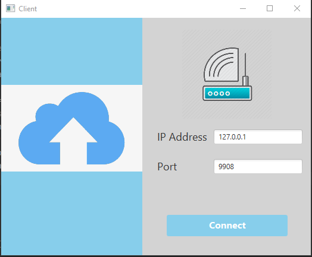

# FTP-Server

The project is about sharing file between two devices using socket. Here one device is Client and another device is Server. At first start the Server program then it Start ServerSocket and start listening on port 6000(you can change form code). Then Client program should be run , Client socket connect with ServerSocket by ServerSocket's Ip address and Port number on which port it's listening.
After connection Client can upload file to Server, download from Server, delete file from server by presssing buttons.

# How the system works:

When we start server program it opes a Server socket on 6000 port and it starts listening. Any Client socket can connect with the Server socket by entering host ip of server and its port in which the Server is listening. So when we start our client  program then we can see Interface like below. 

On the top section of screen there are two textbox for providing Host ip and port number by default host is loclhost and port is 6000. By cliking connect button Client program create a socket then send connection request to server with the  host Ip and port number. As Server socket is listening when it gets client request it accept the request and then they both get connected through this socket. When server accept client request it sends all file infromation to the client. Client can upload file or download and delete file from server . 

When Client wants to upload file, it choose file by clicking choose button. After choosing file it sends “upload” command to the server  and sends the file.  Server gets ready for receiving the file when it gets “upload” command and receives file from client and save the file to the “Uploads” directory. After receiving file server again start listening from client.

When Client  wants to download a file from server it clicks the file from file list of clients graphical user interface. By pressing download it sends “Download” command and fileid to the server and Client socket starts listening from server. When Server receives “Download” command and fileId it sends the file throught the socket outputstream and Client receives it through inputstream and write the file to the file system.

When Client wants to delete a file from the by previously described way. Then a pop up menu apperas, from pop menu button by clicking delete button client sends “Delete” command and file id to the server. When Server receives “Delete” commnad and fileId it deletes the file from the server.

# Server Program image

# How to run programs

1. need to install JavaFx

# Client configuration( Intelij setup)

# Server configuration (Intelij setup)

