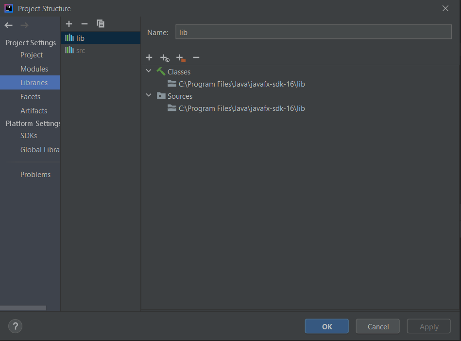
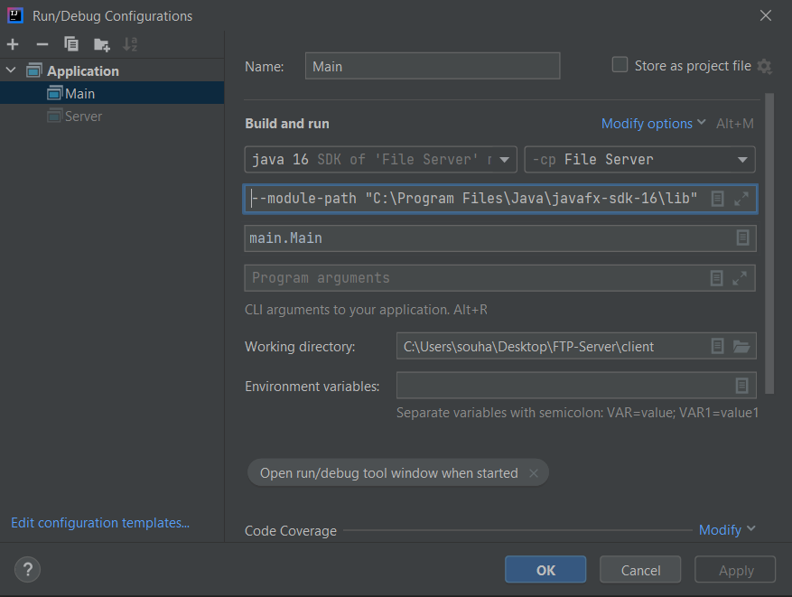
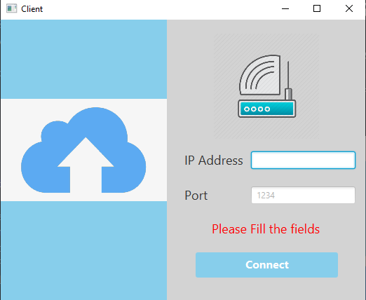
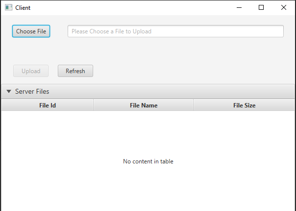
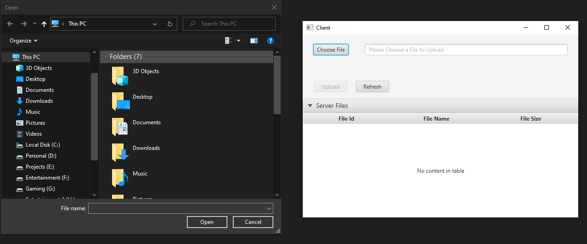
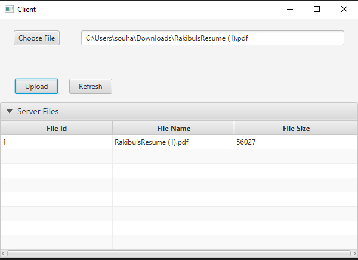
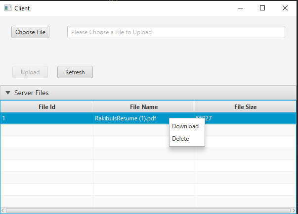
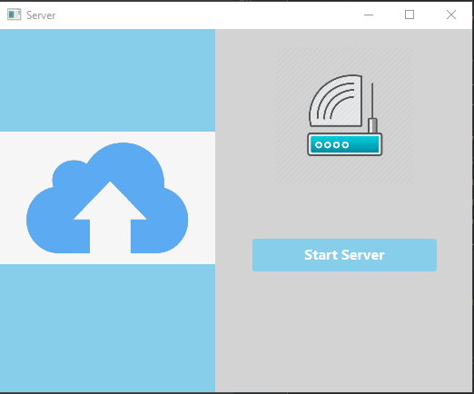
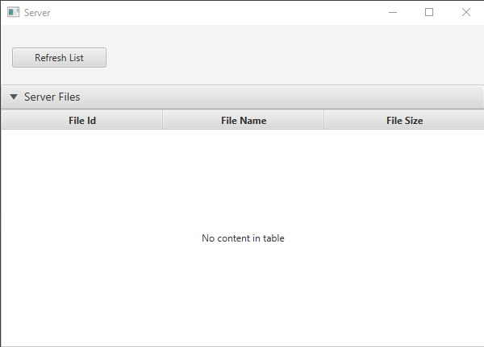
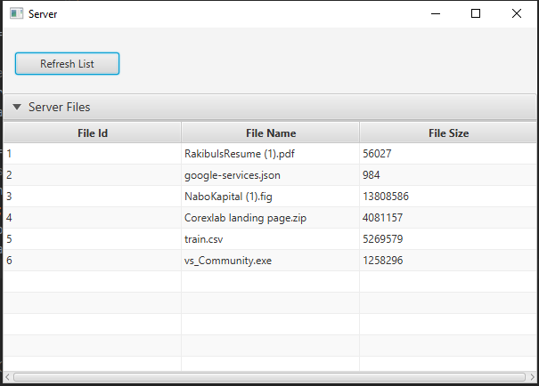

# FTP-Server

## How To Run The System.

1. Intelij, JavaFX library has to be present in the local system.
2. The JavaFx path has to be specified in the intelij project directory.
3. The VM Option has to be adjusted according to the JavaFx path.

A socket in Java is one endpoint of a two-way communication link between two programs running on the network. A socket is bound to a port number so that the TCP layer can identify the application that data is destined to be sent to.

An endpoint is a combination of an IP address and a port number. The package in the Java platform provides a class, Socket that implements one side of a two-way connection between your Java program and another program on the network. 
In this project we developed a complete file server system using socket.The GUI will help us through out the program to execute it's features.

# How the system works:

When we start server program, it opes a Server socket on 9908 port and it starts listening. Any Client socket can connect with the Server socket by entering host ip of server(Generally localhost/127.0.0.1 for the same pc) and its port in which the Server is listening. So when we start our client  program then we can see Interface like below. 

There are two textbox for providing Host ip and port number by default host is 127.0.0.1 and port is 9908. By cliking connect button Client program create a socket then send connection request to server with the  host Ip and port number. As Server socket is listening when it gets client request it accept the request and then they both get connected through this socket. The System performs input validation.

 When server accept client request it sends all file infromation to the client. Client can upload file or download and delete file from the server. 

When Client wants to upload file, it choose file by clicking choose button.

After choosing file it sends “upload” command to the server  and sends the file.  Server gets ready for receiving the file when it gets “upload” command and receives file from client and save the file to the “Uploads” directory. After receiving file server again start listening from client.

When Client wants to download a file from server it clicks the file from file list of clients graphical user interface. By pressing download it sends “Download” command and fileid to the server and Client socket starts listening from server. When Server receives “Download” command and fileId it sends the file throught the socket outputstream and Client receives it through inputstream and write the file to the file system.

When Client wants to delete a file from the by previously described way. Then a pop up menu apperas, from pop menu button by clicking delete button client sends “Delete” command and file id to the server. When Server receives “Delete” commnad and fileId it deletes the file from the server.

# Server Program image

When the server program is launched it opens with an initial GUI with a button to start the server on a specific port (9908).

After the server starts, it opens the list of stored files in the server.

After the some files are transfered from the client and refreshing the list in ther server the file server list will look like below.

